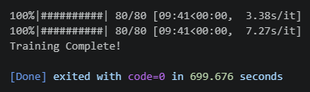
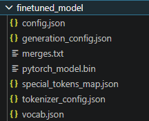
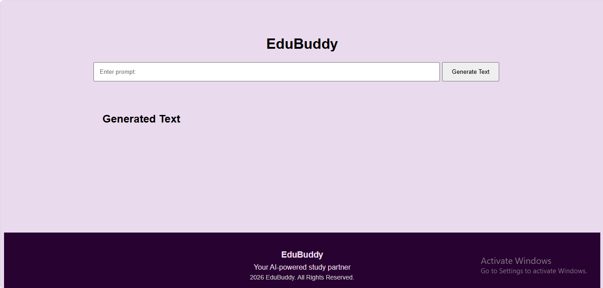
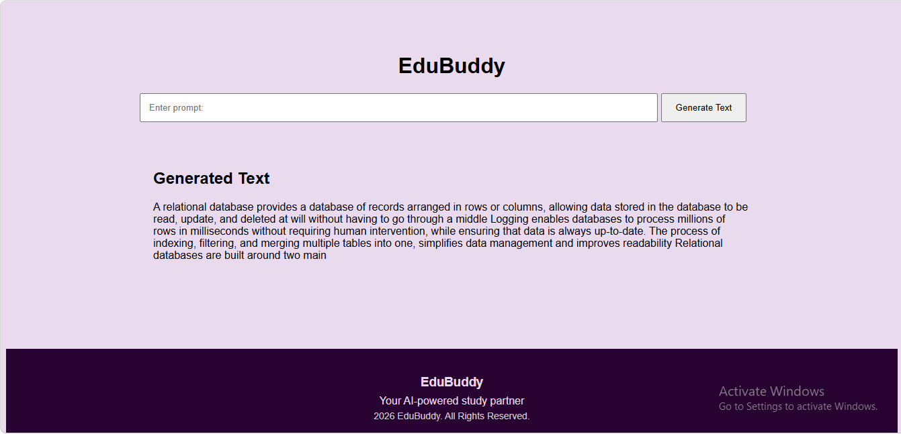

# EduBuddy: AI Text Generator — Flask + GPT-2

An AI-powered web application that generates human-like text using a fine-tuned GPT-2 model. Built with Flask and Hugging Face Transformers, this project demonstrates how transformer models can be deployed as a real-world web service. It is a web application that uses a fine-tuned GPT-2 model to generate coherent, contextually relevant text from a user-provided prompt. The model was fine-tuned on a custom dataset to mimic a specific writing style and structure, then wrapped in a simple web interface so anyone can interact with it through a browser.

## ✨ Features

- 🧠 Text generation powered by a custom fine-tuned GPT-2 model
- 🌐 Simple Flask web interface — no command line needed to use it
- ⚙️ Adjustable generation settings (prompt, length, creativity/temperature)
- 📦 Self-contained — model loads once at startup and serves all requests

## 📸 Screenshots
### Model Training Completed
Shows successful completion of GPT-2 fine-tuning.



### Generated Model Files
Fine-tuned model and tokenizer files saved in the `finetuned_model/` directory.



### Web Interface
User interface for entering prompts and generating text.



### Generated Text Output
Example of text generated by the fine-tuned GPT-2 model.



## 🗂️ Project Structure

```
.
├── app.py                  # Flask application (routes + model loading)
├── finetuned_model/         # Fine-tuned GPT-2 model + tokenizer files
├── templates/
│   └── index.html          # Web interface (prompt form + output display)
├── static/
│   └── style.css           # Styling for the web interface
├── requirements.txt        # Python dependencies
├── train.py                 # Fine-tuning script used to train the model
├── screenshots/
│   ├── output1.png
│   ├── output2.png
│   ├── output3.png
│   └── output4.png
├── .gitignore
├── data.txt                 # Training dataset
└── README.md

```

## ⚙️ Requirements

- Python 
- Flask
- PyTorch
- Hugging Face `transformers`

Install dependencies:

```bash
pip install -r requirements.txt
```

`requirements.txt`:
```
Flask
torch
transformers
accelerate
datasets
huggingface_hub
tokenizers
```

## 🚀 Running Locally

1. Clone the repository:
```bash
git clone https://github.com/Khwaishg/PRODIGY_GA_01.git
cd PRODIGY_GA_01
```

2. Install dependencies:
```bash
pip install -r requirements.txt
```

3. For the first time, train the model.
```bash
python train.py
```
Make sure your fine-tuned model files are present in `finetuned_model/` (model weights, config, tokenizer files).

4. Run the app:
```bash
python app.py
```

5. Open your browser at:
```
http://127.0.0.1:5000
```

## 🧠 How It Works

1. **Model loading** — On startup, `app.py` loads the fine-tuned GPT-2 model and tokenizer from the `finetuned_model/` folder into memory once, so requests don't reload it repeatedly.
2. **User input** — The web form (`index.html`) collects a text prompt from the user.
3. **Generation** — The Flask route passes the prompt to the model's `generate()` method, which predicts and extends the text token by token.
4. **Response** — The generated text is rendered back into the HTML page for the user to read.

## 🎛️ Generation Parameters (configurable in `app.py`)

| Parameter | Effect |
|---|---|
| `max_length` | Maximum length of generated text |
| `temperature` | Higher = more creative/random; lower = more focused |
| `do_sample` | `True` for varied output, `False` for deterministic (greedy) output |

## ⚠️ Troubleshooting

- **Out of memory errors** — Lower `max_length`, use the smallest GPT-2 variant (`gpt2`), and avoid loading the model more than once (e.g. inside the request handler).
- **Incoherent text** — The fine-tuning dataset may be too small; more training data improves topical coherence.
- **Slow response times** — Expected on CPU-only free hosting; consider reducing `max_length` for faster generation.
- Dependency installation errors** — Python 3.11 is recommended for this project; newer Python versions (3.12+) can have compatibility issues with some torch/transformers dependency versions.

## 📌 Notes

- This app is for demonstration and educational purposes; the fine-tuned model reflects the style of its training data, not factual accuracy.
